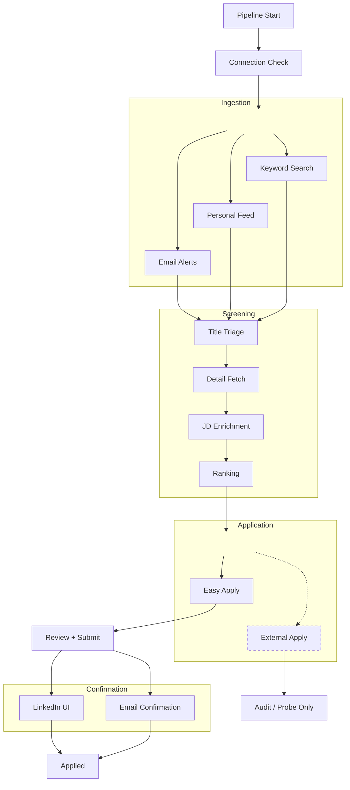

# Job Finding Agent

Automates the early job-search pipeline: collect listings, screen them with LLM-assisted stages, rank them, and support application workflows with a human review step before submission.

**Current Scope**

LinkedIn is the only source currently supported:
- keyword search
- recommended feed
- email alerts

The architecture is source-agnostic, so new sources can be added under `app/sources`.

**Implemented**

- Core sourcing and screening pipeline through ranking
- LinkedIn Easy Apply preview, review, submit, and confirmation flows
- External apply audit and probe tooling

**Not In `scripts.pipeline`**

- Automatic application submission
- Production-ready external apply automation

**Ongoing Development**

- Ranking calibration and feedback loops are still being shaped.
- The application candidate profile is still evolving; some user fields and reusable answers are only partially modeled today.

## To Be Supported

- **External Apply agent** — currently under investigation. The repo includes draft tooling around a browser-use based agent for off-LinkedIn application flows.
- **Current direction** — use the agent for navigation, extract fields/questions, answer them with the same dossier + LLM pattern used by Easy Apply, and stop at human review before any submit.
- **Why it is still a draft** — the navigation loop works in probes, but token cost is still too high and the workflow needs more coverage for interactive field edge cases and review/recovery behavior.

## Pipeline




Jobs move through persisted stages:

```
discovered → triaged → detailed → enriched → ranked → applied
```

Any stage can also transition to `not_applicable`.

## Stack

- Python 3.11
- Pydantic models for all data boundaries
- Playwright + Chrome remote debugging (CDP) for browser automation
- SQLite for persistence
- OpenAI-compatible LLM API
- Structured LLM output with JSON Schema validation (`strict: True`)
- IMAP for email ingestion

## Project structure

```
app/
├── models/          # Pydantic data contracts (job, candidate, application, config)
├── services/        # Infrastructure (LLM client, SQLite storage, browser, email)
│   ├── llm/         #   OpenAI-compatible structured chat completion
│   └── storage/     #   SQLite persistence layer
├── sources/         # Job source ingestion
│   └── linkedin/    #   Feed scraping, email alerts, detail page fetch
├── screening/       # LLM screening: title triage → enrichment → ranking
├── application/     # Application automation
│   ├── easy_apply/  #   LinkedIn Easy Apply (parse → classify → answers → fill → navigate → review)
│   └── external/    #   External application agent (draft, browser-use)
├── prompts/         # LLM prompts + JSON Schema response contracts
└── utils/           # Generic helpers (retry with backoff)

scripts/             # Runnable pipeline entrypoints
├── pipeline.py      #   Full pipeline orchestrator
├── connection/      #   Browser CDP + IMAP health checks
├── source/          #   Job collection (browser, email)
├── screening/       #   Title triage, detail fetch, JD enrichment, ranking
├── easy_apply/      #   Probe, preview, review, submit
├── confirmation/    #   Post-submit verification (email, UI, watcher)
├── external_apply/  #   External apply audit + browser-use probe
└── storage/         #   DB init + inspection

tests/               # Unit and integration tests
config/              # app.yaml (runtime config, gitignored) + template
docs/                # Design docs (architecture, pipeline, easy-apply, LLM prompts)
data/                # Runtime: SQLite DB, logs, artifacts, review JSONs (gitignored)
secrets/             # Candidate dossier, Chrome profile (gitignored)
```

Most `app/` subfolders include a local README describing their internal files.

## Setup

```bash
# Clone and create conda environment
conda create -n job-finding-agent python=3.11
conda activate job-finding-agent

# Install in editable mode
pip install -e ".[dev]"

# Install Playwright browsers
playwright install chromium

# Copy config template and fill in your settings
cp config/app.template.yaml config/app.yaml

# Initialize the database
python -m scripts.storage.init_db

# Run tests
pytest
```

## Running the pipeline

```bash
# Core pipeline only: connection check -> source -> triage -> detail -> enrich -> rank
python -m scripts.pipeline

# Individual pipeline stages
python -m scripts.connection.browser
python -m scripts.source.browser
python -m scripts.source.email
python -m scripts.screening.title_triage
python -m scripts.screening.detail_fetch
python -m scripts.screening.jd_enrichment
python -m scripts.screening.ranking

# Easy Apply workflow
python -m scripts.easy_apply.probe
python -m scripts.easy_apply.preview_batch
python -m scripts.easy_apply.review
python -m scripts.easy_apply.submit

# Post-submit confirmation
python -m scripts.confirmation.watcher

# External apply development tools
python -m scripts.external_apply.audit
python -m scripts.external_apply.browser_use_probe
```

`scripts.pipeline` stops at ranking. Application and confirmation flows are separate entrypoints.

## Design decisions

- **Explicit pipelines over loose agents.** Each stage has a clear contract: load from DB, process, write back to DB. No implicit state passing.
- **Two-tier answer resolution.** Easy Apply questions are first matched deterministically against a candidate dossier (label rules), then unmatched questions go to an LLM batch. This keeps most answers fast, cheap, and predictable.
- **Orthogonal ranking.** Jobs are scored on three independent dimensions (role match, level match, preference match) rather than a single composite score, giving more actionable ranking output.
- **Human-in-the-loop.** Applications pause at review-ready state. Nothing is submitted without explicit human confirmation.
- **Structured LLM output.** All LLM calls use JSON Schema response format with `strict: True` — no free-text parsing.

## Docs


| Doc                                                    | What it covers                                        |
| ------------------------------------------------------ | ----------------------------------------------------- |
| [docs/overview.md](docs/overview.md)                   | Project scope, implemented pipeline, planned features |
| [docs/architecture.md](docs/architecture.md)           | Code structure, storage schema, module map            |
| [docs/pipeline.md](docs/pipeline.md)                   | Script runner details, config, job state transitions  |
| [docs/easy-apply.md](docs/easy-apply.md)               | Easy Apply module deep-dive                           |
| [docs/external-apply.md](docs/external-apply.md)       | External application agent status and draft direction |
| [docs/logging.md](docs/logging.md)                     | Logging contract                                      |
| [docs/llm/title-triage.md](docs/llm/title-triage.md)   | Title triage prompt design                            |
| [docs/llm/jd-enrichment.md](docs/llm/jd-enrichment.md) | JD enrichment prompt design                           |
| [docs/llm/ranking.md](docs/llm/ranking.md)             | Ranking prompt design                                 |
